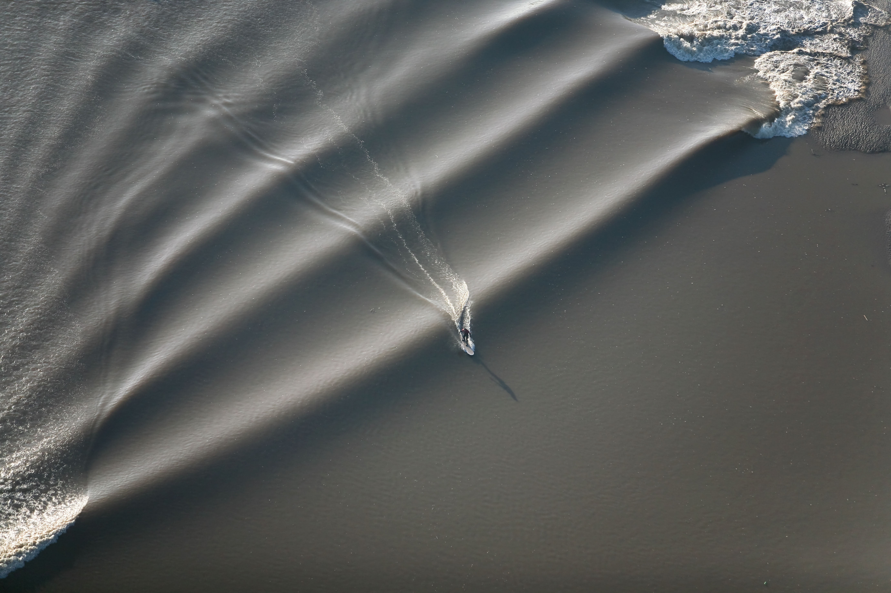
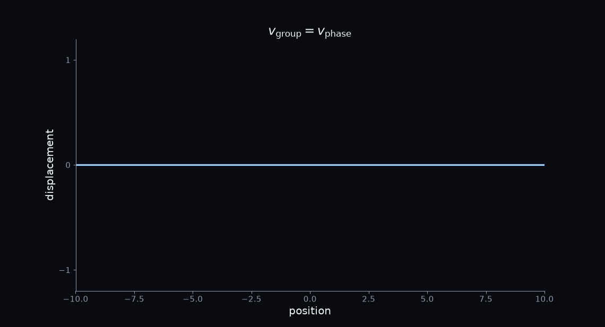
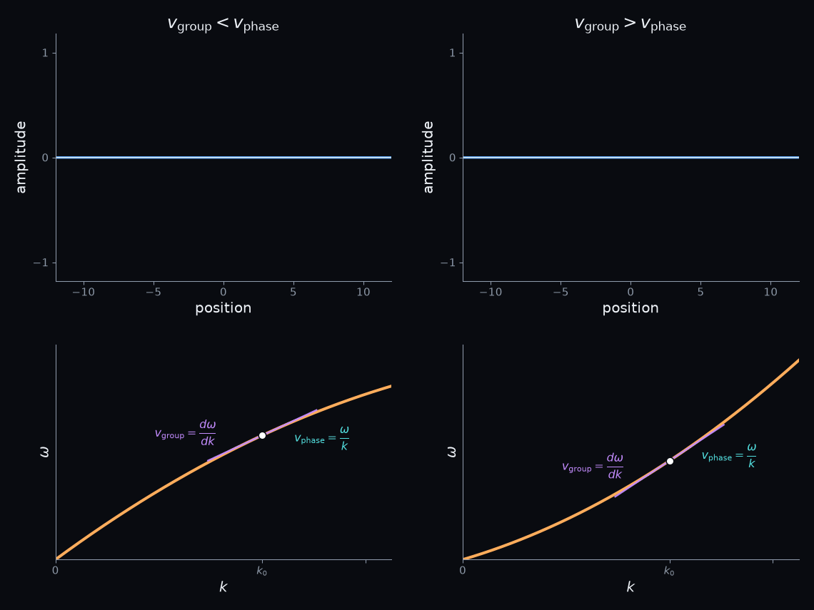
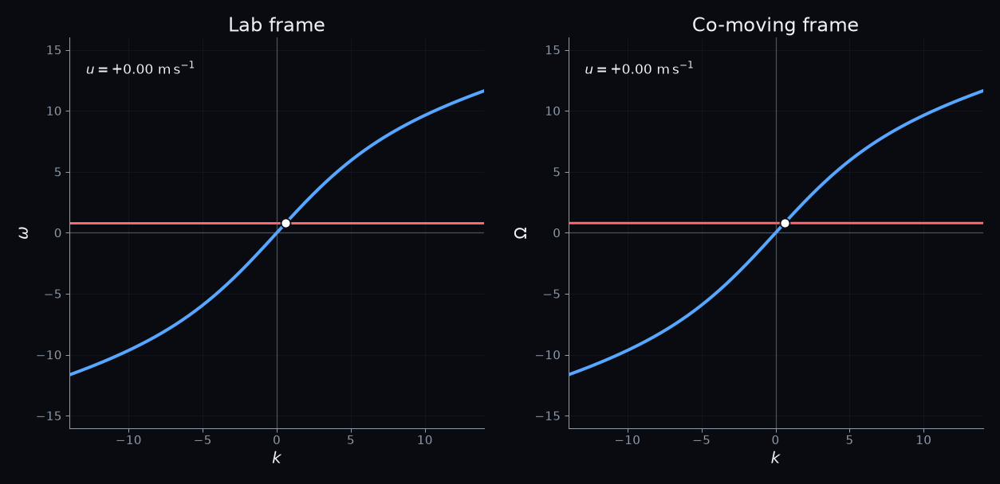
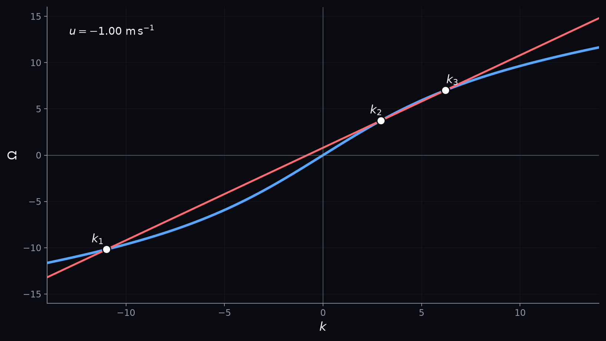

# The SpeedS of Light

## How Dispersion Connects Rainbows to Hawking Radiation

**Feature image.** The Severn bore — a tidal bore travelling upstream on the River Severn (Gloucestershire, UK). Photo: Jamie Cooper/Galaxy / Alamy Stock Photo.

*Alt text: A large tidal bore propagating upstream along the River Severn, forming a distinct moving front across the river. Photo: Jamie Cooper/Galaxy / Alamy Stock Photo.*

<!-- KEY TAKEOUT:
Open a question rather than explain the bore. The reader should wonder how this river has anything to do with the title. https://www.alamy.com/stock-photo-a-rare-five-star-severn-bore-photographed-from-the-air-2-march-2010-28472060.html?imageid=55D3E650-D10B-4001-871F-5EA083D9DAE5&pn=9&searchId=4580bb4ada4501c9282473991419310d&searchtype=0
-->
The constant speed of light in vacuum was one of the great insights of nineteenth-century physics. And we all learned in school that in materials things become more complicated: different colors travel at slightly different speeds, helping a prism — or a raindrop — spread white light into a spectrum.

But even that picture is deceptively simple. It treats a wave as if it had one frequency, one wavelength, and one speed. What happens when we look at a pulse, containing many wavelengths at once? And what happens when the medium itself is moving?

Suddenly, "the speed of a wave" is no longer a single number.

Imagine a wave trying to travel upstream in the river in the picture above. The current carries the water one way while the wave tries to travel the other. If the current becomes strong enough, can the wave simply stop?

Interestingly enough, this question takes us surprisingly close to black-hole physics. Waves moving through flowing water can obey much the same mathematics as waves near a black-hole horizon. Push the analogy further, and scientists can even reproduce some of the classical physics underlying Hawking radiation in a water basin.

So, before we get anywhere near a black hole, we need to look more carefully at a deceptively simple question:

What do we actually mean by the speed of a wave?

## The Speed of a Wave

<!-- KEY TAKEOUT:
Our familiar intuition is that a wave has a wavelength, a frequency, and therefore a speed.
-->

Back in school, waves seemed simple.

Draw a sinusoid. Measure its wavelength. Count how often the crests pass. From wavelength and frequency, you have its speed.

For a sinusoidal wave, that speed is the **phase velocity**. You calculate it by multiplying frequency and wavelength. The more common notation is to divid ω (the frequency time 2π) by the wavenumber (2π divided by the wavelength).

vₚ = ω/k

It tells us how fast a point of constant phase — a crest, for example — moves through space.

For many of the waves we first encounter, this is all we need. The wave moves, its crests move with it, and there seems little reason to ask what we mean by *the speed of the wave*.

## When the Packet Leaves the Crests Behind

<!-- KEY TAKEOUT:
A localized wave packet introduces a second speed: the packet and the crests need not move together.
-->

Real waves are rarely infinite sinusoids. They come in pulses, bursts and packets. In non-dispersive media, where the phase velocity in independent of frequency these packets travel at the same speed as the phase.

**Figure 1. Phase and group velocity are the same in a nondispersive medium.** A wave packet travels without changing shape because the carrier oscillations and the packet envelope move together: \(v_{\mathrm{group}} = v_{\mathrm{phase}}\).

*Alt text: Animation of a blue sinusoidal wave packet with a white envelope moving from left to right without changing shape. The carrier crests remain locked to the envelope, illustrating equal group and phase velocity.*

In a dispersive medium this is can be different. The crests can run forward through the packet. Or the packet can overtake its own crests.

**Figure 2. Dispersion separates phase velocity from group velocity.** Top: two wave packets in which the carrier oscillations move at a different speed from the envelope. On the left, \(v_{\mathrm{group}} < v_{\mathrm{phase}}\); on the right, \(v_{\mathrm{group}} > v_{\mathrm{phase}}\). Bottom: the corresponding dispersion curves. The phase velocity is \(v_{\mathrm{phase}}=\omega/k\), while the group velocity is the local slope, \(v_{\mathrm{group}}=d\omega/dk\).

*Alt text: Four-panel figure. The top-left animation shows a blue carrier wave moving faster than its white envelope, so group velocity is smaller than phase velocity. The top-right shows the envelope moving faster than the carrier, so group velocity is larger than phase velocity. The two lower panels show the corresponding curved omega-versus-k dispersion relations, with a short tangent at the selected point indicating the group velocity.*

The velocity of the packet is the **group velocity**:

v_g = dω/dk

That derivative is more than a mathematical definition. It has a beautifully simple geometric meaning.

## The Shape That Determines How Waves Move

<!-- KEY TAKEOUT:
The dispersion curve contains both velocities: phase velocity is a secant and group velocity is a tangent.
-->

Plot frequency ω vertically and wavenumber k horizontally.

Every possible sinusoidal wave in the medium becomes a point on a curve: the **dispersion relation**.

The phase velocity comes from the line connecting that point to the origin.

The group velocity comes from the tangent to the curve at that same point.

If the dispersion relation is a straight line, the two slopes are identical. Phase and group velocity are the same.

Bend the curve, and they separate.

That one geometric idea will carry us through the rest of the story.

## Why Rainbows Exist

<!-- KEY TAKEOUT:
Dispersion is already familiar from optics: different frequencies can propagate differently through the same material.
-->

Light gives us perhaps the most familiar example of dispersion.

The refractive index of glass depends on frequency. Different colours therefore propagate differently through it, which is why a prism separates white light into a spectrum.

A rainbow adds some extra physics — refraction, reflection inside water droplets and geometry — but its colours ultimately depend on the same fact: the optical properties of water vary with wavelength.

Dispersion is not an exotic effect.

We see its consequences whenever white light breaks into colour.

## Dispersion Curves Come in Many Shapes

<!-- KEY TAKEOUT:
There is no universal dispersion curve. Its shape comes from the underlying physics of the system.
-->
Different physical systems produce remarkably different dispersion curves.

An ideal continuous string or rope is essentially nondispersive. Add discrete masses like beads and the curve bends. We even find that certaing wavelengths are not possible in this siguatio, creating a 'forbidden band' in the dispersion plot.

For surface waves on water we have in fact two different mechanism determining the wave speed. Both gravity and surface tension are trying to flatten the surface. Where gravity and surface tension compete, water waves reach a minimum phase velocity, marking the crossover between long gravity waves and short capillary waves.

Even a free quantum particle has a dispersion relation. For a Broglie wave the frequency increases with the square of its wavenumber, producing an upward-curving parabola. Remarkably, the velocity we associate with the particle is the **group velocity of its wave packet**, rather than the phase velocity of the underlying oscillations.

Different physics. Different curves. The idea stays the same: **the shape of the dispersion relation determines how waves move.**

For what comes next, we need a medium with one additional property. The medium itself can move. Let's return to water and see what happens if it flows.

## Water Waves

<!-- KEY TAKEOUT:
Water provides a naturally dispersive system whose waves depend on wavelength and depth — and the water itself can flow.
-->

For surface gravity waves on water of depth h, the dispersion relation is

ω² = gk tanh(kh)

The exact formula is less important here than the shape it produces.

At long wavelengths in shallow water, the curve is nearly straight. At shorter wavelengths it bends. Phase and group velocity separate.

So water gives us a familiar medium with a nonlinear dispersion curve, and we can make it flow.

## Waves in the River
<!-- KEY TAKEOUT:
Once the medium moves, the frequency measured in the laboratory and the frequency measured with the medium are no longer the same.
-->

In the photo featured at the top of tis article we see the Severn bore. It is a  tidal bore — a moving front shaped by the tide travelling against the current. In the 90's I had to opportunity to ride this bore upstream in a canoe. Although I did not last very long on, it was a majestic experience to see this wave approach slowly against the current.

So, the river has become a moving medium. Imagine standing beside it. You measure a wave with frequency ω and wavenumber k. But now imagine someone someone drifting with the water (maybe because they fell off their surtboard). He would measure a different frequency (ω′). If the water moves at velocity U, the two are related by the Doppler shift.

ω′ = ω − Uk

Different wavelengths will lead to a different shift. This means that for a co-moving observer the dispersion curved is distorted by the flow speed. In Figure 3 we show teh dispersion curve from the perspective of the bystander, and the co-moving observer.

## One Frequency, Several Waves

<!-- KEY TAKEOUT:
The central reveal: in a moving dispersive medium, one fixed laboratory frequency can correspond to several distinct wavenumbers and therefore several different wave modes.
-->

**Figure 3. The same moving medium viewed in two frames.** Left: in the laboratory frame, the frequency \(\omega\) is fixed while the dispersion curve changes as the flow speed \(u\) changes. Right: in the locally co-moving frame, the intrinsic water-wave dispersion stays fixed while the same conserved laboratory frequency appears as the tilted line \(\Omega=\omega-uk\). The white dots mark the same allowed modes in both views.

*Alt text: Two animated dispersion plots shown side by side. In the laboratory-frame panel, a blue dispersion curve tilts and changes with flow speed while a red horizontal frequency line stays fixed. In the co-moving-frame panel, the blue water-wave dispersion curve stays fixed while a red straight line tilts as the flow speed changes. White dots mark the intersections in both panels, and the displayed flow speed passes through zero.*

In Figure 4 we see that for a wave in flowing water the line representing the frequency observed by a co-mover (ω′) corresponds to more than one wave number. Each intersection between the ω′-line and thee dispersion curve is a possible wave. They all have the **same frequency in the laboratory**, but they have different wavelengths, different phase velocities, different group velocities, **and even different directions of propagation.**

The assumption we started with has broken.

**One frequency does not necessarily mean one wave.**

**Figure 4. One frequency can correspond to several wave modes.** For a fixed laboratory frequency, the allowed wavenumbers are the intersections between the intrinsic water-wave dispersion relation and the Doppler-shifted line \(\Omega=\omega-uk\). Here there are three real solutions, \(k_1\), \(k_2\), and \(k_3\): three distinct wave modes at the same laboratory frequency.

*Alt text: Static omega-prime-versus-k dispersion plot. A blue curved water-wave dispersion relation is crossed by a red straight Doppler-shifted line. Three white intersection points are labelled k1, k2, and k3, showing that one fixed laboratory frequency can correspond to three different wavenumbers.*

## A Negative Frequency That Is Still a Real Wave

<!-- KEY TAKEOUT:
One of the allowed modes can have positive laboratory frequency but negative frequency in the frame moving with the medium.
-->

There is a surprise hiding among those intersections. Remember that the waves that correspond to the different intersections of the ω′-line and the dispersion curve correspon to the same frequency for a bystander. For the co-moving observer one of the waves has a negative frequency in the frame moving with the water:

ω > 0, while ω′ < 0.

The wave has not acquired a negative amplitude. Nor is it travelling backwards in time. The sign tells us how its phase evolves in a particular reference frame.

Our waves are still entirely classical, but this distinction between positive- and negative-frequency modes will become important when we reach the analogue of Hawking radiation.

## Where the Modes Meet

<!-- KEY TAKEOUT:
Uniform flow gives several independent modes. Spatially varying flow can bring those modes together, setting the stage for horizons and mode conversion.
-->

So far we have made one important simplification.

Our water has been flowing everywhere at the same speed.

Now imagine that the current changes with position.

The laboratory frequency remains fixed, but U changes. The Doppler line therefore moves across the dispersion curve.

And the intersection points move with it.

Two of them can approach each other.

They can meet.

And something remarkable happens to a wave approaching that point.

**For that, we need a horizon.**

That is where we will continue next time.

## References

1. Brillouin, L. *Wave Propagation and Group Velocity*. Academic Press, 1960.

2. Lighthill, M. J. *Waves in Fluids*. Cambridge University Press, 1978.

3. Ashcroft, N. W. & Mermin, N. D. *Solid State Physics*. Holt, Rinehart and Winston, 1976.

4. Hawking, S. W. “Particle Creation by Black Holes.” *Communications in Mathematical Physics* **43**, 199–220 (1975).

5. Unruh, W. G. “Experimental Black-Hole Evaporation?” *Physical Review Letters* **46**, 1351–1353 (1981).

6. Schützhold, R. & Unruh, W. G. “Gravity Wave Analogues of Black Holes.” *Physical Review D* **66**, 044019 (2002).

7. Rousseaux, G., Mathis, C., Maïssa, P., Philbin, T. G. & Leonhardt, U. “Observation of Negative-Frequency Waves in a Water Tank: A Classical Analogue to the Hawking Effect?” *New Journal of Physics* **10**, 053015 (2008).

8. Weinfurtner, S., Tedford, E. W., Penrice, M. C. J., Unruh, W. G. & Lawrence, G. A. “Measurement of Stimulated Hawking Emission in an Analogue System.” *Physical Review Letters* **106**, 021302 (2011).

9. Leonhardt, U. & Robertson, S. “Analytical Theory of Hawking Radiation in Dispersive Media.” *New Journal of Physics* **14**, 053003 (2012).

10. Barceló, C., Liberati, S. & Visser, M. “Analogue Gravity.” *Living Reviews in Relativity* **14**, 3 (2011).