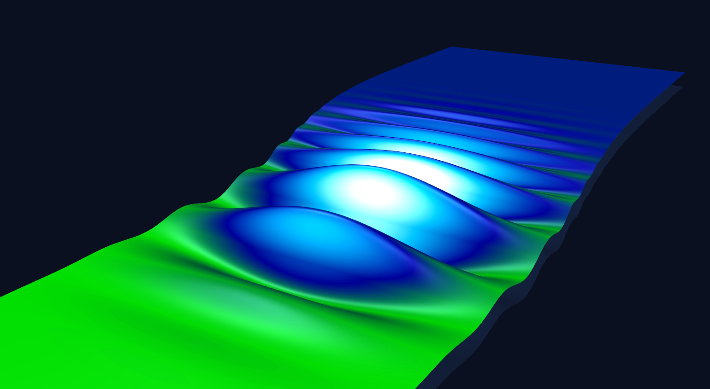
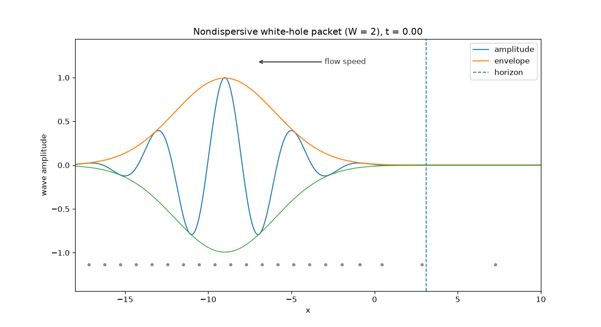
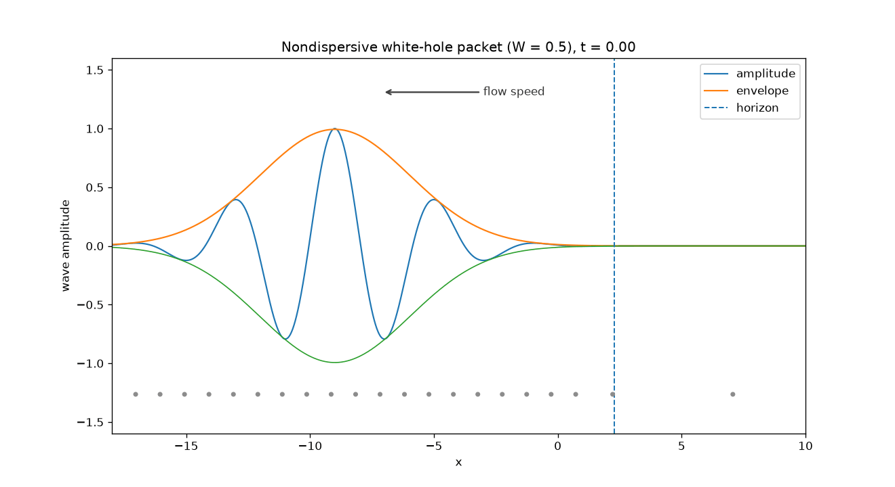
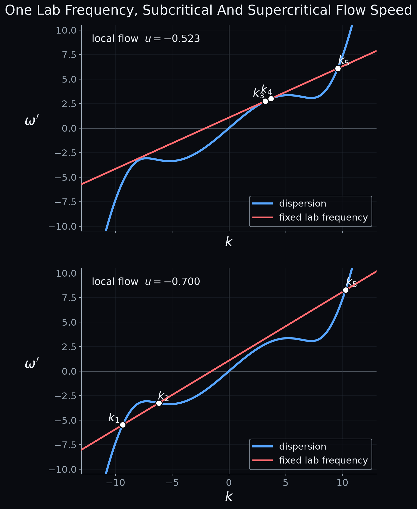
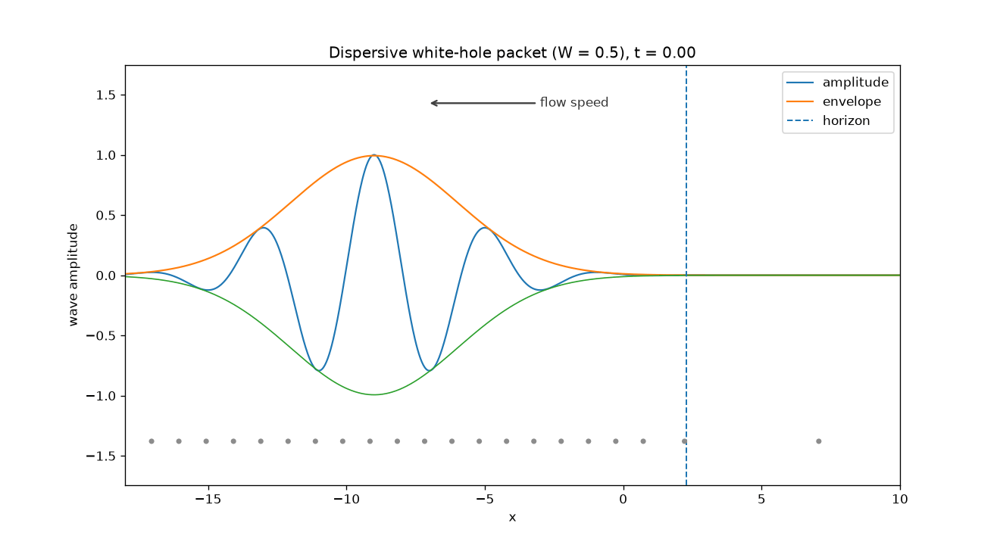
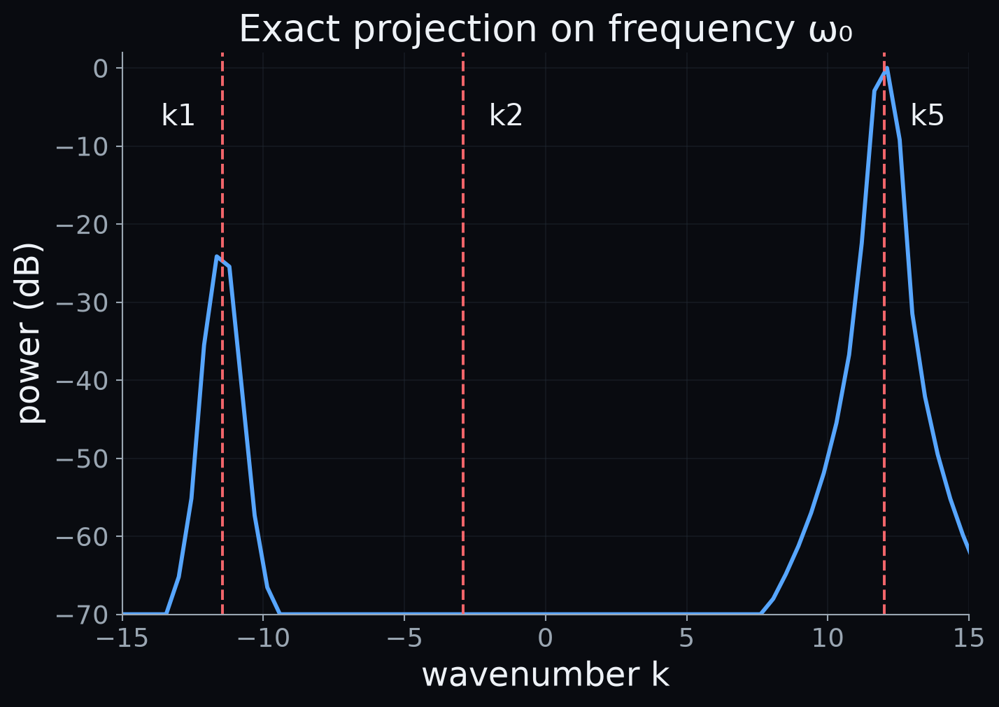
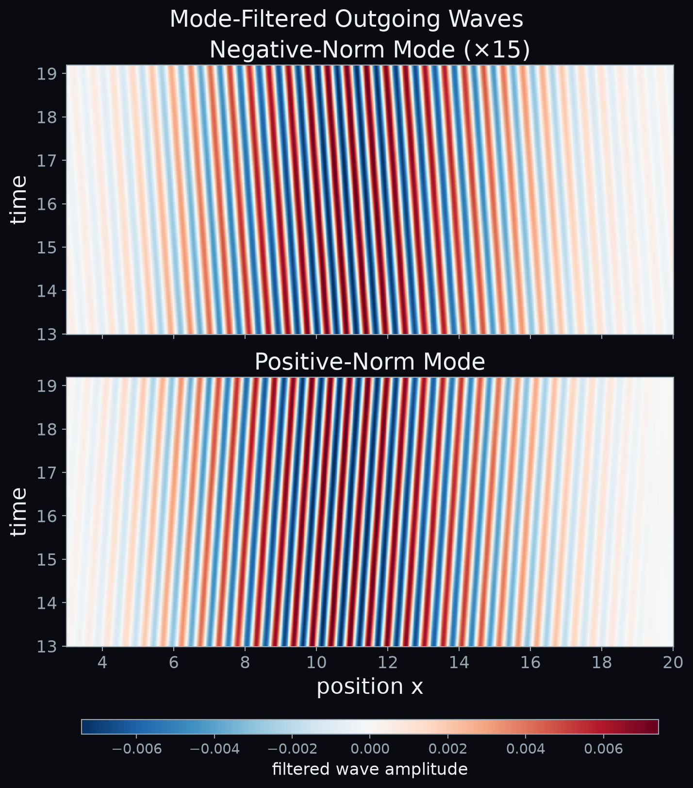
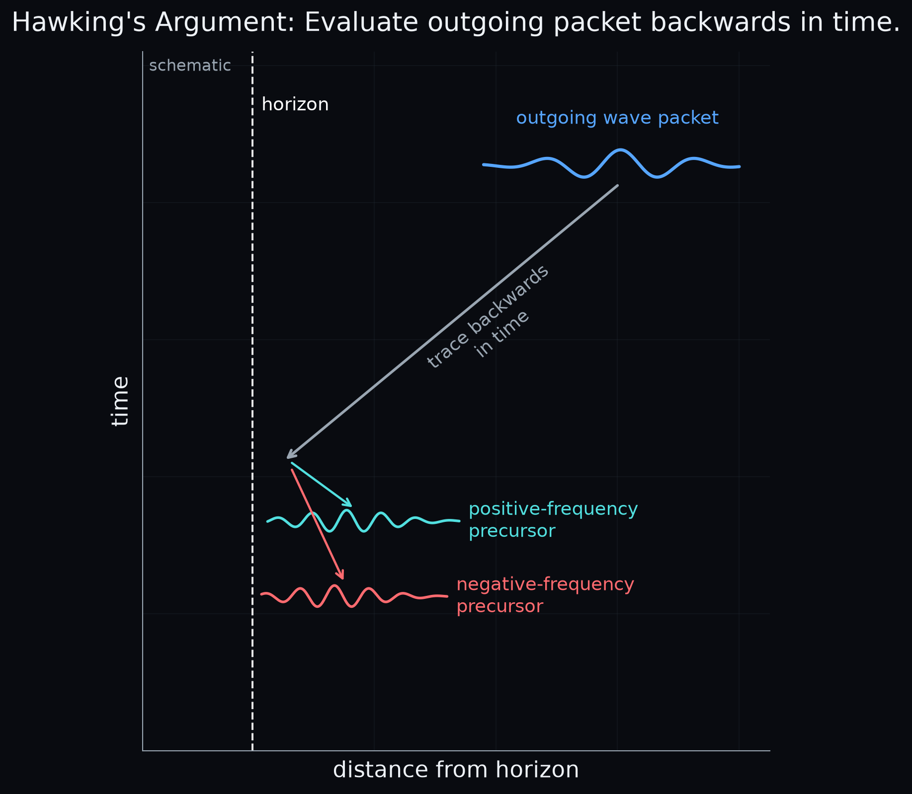

# [Working Title]

### *[Working Subtitle]*

**Feature image** — Wave approaching a white-hole horizon. Image generated with PyVista by author.
*Alt text: Colored visualization of a wave approaching a white-hole horizon. The wave gets compressed near the horizon.*

A black-hole horizon is a point of no return. Cross it, and even light cannot get back out. This is the story we all know; a striking fact about spacetime. Nobody gets to walk up to a real horizon to see what happens.

But the equation describing a wave near a black-hole horizon is, mathematically, the same as the equation for a wave in a fast-flowing fluid. Can we use that to actually build a horizon? Take a channel of moving water, shape the flow, and create a boundary a wave cannot cross. With this, we can send a wave at the horizon and watch what happens.

In fact, scientists have been running this experiment, and what is observed reaches close to one of the most famous predictions in black-hole physics: Hawking radiation. This triggers the question: how much of that mechanism actually needs a black hole at all?

In this post, we are going to run that experiment too, in simulation, and watch what happens.

---

## Black Holes, White Holes.

Picture a wave that propagates at some speed relative to the medium it is travelling through, while the medium itself is also flowing. If that medium flows fast enough, somewhere the wave cannot keep up.

In the *black-hole* version of this story, the flow gets faster as we move inward. A wave sitting in the fast-flow region tries to escape outward, but the current is too strong. It cannot get out.

Now reverse the whole picture. Run the flow the other way, and the same boundary becomes a barrier from the outside instead: a wave approaching from the slow-flow side simply cannot get in. This is the *white-hole* version, and it turns out to be the more convenient one for us. We cannot place a detector inside a black hole and watch a wave fail to escape. But we can launch a wave toward a white-hole horizon from the accessible, slow-flow side, and watch what happens to it in real time.

**Figure 1 — Black-hole and white-hole horizons.** In a black-hole analogue, a wave in the fast-flow region cannot escape against the current. Reverse the process and we obtain a white-hole horizon: an incoming wave encounters a region it cannot enter. The white-hole version allows us to launch a wave toward the horizon and watch what happens. Image by author.

*Alt text: Side-by-side schematic of black-hole and white-hole analogue horizons. In the black-hole panel, the background flow points toward a fast-flow region and a wave trying to escape is blocked at the horizon. In the white-hole panel, the flow direction is reversed and an incoming wave approaching from the slow-flow side is blocked from entering the fast-flow region.*

So, that will be our experiment: send a wave against a current that gets stronger as it goes, and see what it actually does when it reaches the point it cannot cross.

## Send in the Wave

Let us start with the simplest version we can build: one wave speed relative to the water, no dispersion, and a flow that smoothly speeds up from slow to fast. Launch a wave packet from the slow-flow side, aimed straight at the horizon, and let it travel against the current.

At first, not much happens. The packet moves forward, more or less as it would in still water. But as the counter-current strengthens, its progress in the lab frame slows down — and its wavelength starts shrinking.

**Figure 2 — A wave approaching a smooth white-hole horizon without dispersion.** The wave travels against an increasingly strong current. Its progress slows while its wavelength becomes shorter and shorter. In the simulation the wave eventually appears to disappear close to the horizon. Image by author.

*Alt text: Animation of a localized wave packet travelling toward a white-hole horizon through an increasingly strong opposing flow. The packet slows down and its oscillations become progressively shorter in wavelength near the horizon.*

Close to the horizon, the wave seems to vanish. This is because the numerical grid used for the simulation has a smallest wavelength it can represent, and the wave has shrunk past it. This is not a flaw we could fix with a finer grid. In the ideal, continuous version of this model, there is no smallest wavelength at all. As the horizon is approached, the group velocity heads to zero, and the wavelength heads to zero. Any grid, however fine, eventually runs out of resolution.

So, in the idealised version of this experiment, the wave never really stops — it just keeps blueshifting, forever, into shorter and shorter wavelengths as it nears the horizon. Nothing in the model itself puts a floor under how short that wavelength can get.

That is a warning sign. Push the calculation to arbitrarily short wavelengths, and sooner or later we will be making claims about scales where the theory cannot be trusted anymore.

This is an analog of the famous 'trans-Planckian problem', applied to a water wave.

> **The wave never really stops. It just keeps shrinking — forever, into wavelengths our model was never built to reach.**

---

## What If We Make the Horizon Sharp?

So far, we used a smooth ramp from slow flow to fast flow for the simulation. What happens if we make that transition abrupt instead?

**Figure 3 — Reflection from a sharp nondispersive horizon.** When the change in flow becomes sufficiently abrupt, part of the incoming wave reflects before the numerical blueshift becomes arbitrarily large. This is ordinary scattering from a sharp background change within the same nondispersive mode structure; no additional wave components have yet appeared. Image by author.

*Alt text: Animation of a wave packet travelling toward a sharp white-hole transition. Part of the packet reflects back toward the slow-flow region while the background remains nondispersive.*

Something different happens; instead of blueshifting away into oblivion, part of the wave bounces straight back the way it came. The abruptness of the transition throws part of the wave backward. Note that this reflection does not give us any *new* type of wave. It is still the same single wave branch we started with, just travelling in the other direction. Nothing has appeared that was not already in our simple model.

A wave can be turned back by an abrupt horizon. That is reflection, nothing extraordinary. This will matter shortly. Once we let the wave itself become dispersive — where different wavelengths travel at different speeds — a sharp horizon will do something new: it will not just reflect the wave, it will convert it into wave components that were not there before.

---

## But Real Waves Do Not Have One Speed

Real water waves are dispersive (see our previous post on this topic). Different wavelengths do not all travel at the same speed. This matters. Go back to the runaway blueshift: in the idealised, nondispersive model, the wave's wavelength shrinks without limit as it approaches the horizon. Real water cannot actually do that; at some scale, the simple picture of a smooth fluid surface simply stops applying. Dispersion is not an inconvenient complication we are choosing to add — it is what any real medium does once you push it to short enough wavelengths.

So dispersion is, in a very concrete sense, water's own way of avoiding the trans-Planckian problem. The wave never actually needs to reach zero wavelength, because somewhere along the way, the physics changes. That raises the question of which dispersion relation to use — and here water offers no special authority. Its dispersion relation is just one physically reasonable cutoff among many.

That is the point: for a real white-hole horizon, we do not know what the dispersion relation is. What we do in our simulation is pick one reasonable dispersion relation, run the experiment, and ask which features of the process survive.

> **The point is not that water has the right microscopic physics. The point is that we do not know the right microscopic physics — so we can ask what survives when we change it.**

This turns out to be a well-studied question, and the answer is reassuring. Push the same wave-equation-near-a-horizon problem through several completely different high-frequency cutoffs — water's own gravity-capillary dispersion, a lattice-like quartic modification, even a laser pulse propagating through a nonlinear dielectric medium — and the same qualitative mode-conversion behaviour keeps showing up. Unruh and Schützhold went as far as naming this the 'universality' of the effect.
---

## Turn On Dispersion
Let us go back to the sharp horizon from a few sections ago, but this time give the wave a real dispersion relation — one where the propagation speed actually depends on wavelength.

To see why that changes anything, it helps to look at the dispersion curve itself, rather than the wave directly.

**Figure 4 — One lab frequency, different allowed modes.** The blue curve shows the co-moving dispersion relation used in the simulation, while the red line represents the same conserved laboratory frequency at two local flow speeds. In the upper panel, the flow is still subcritical and the relevant roots lie on the positive-frequency side. In the lower panel, after the flow has become supercritical, two negative-frequency roots and one positive-frequency root are available. The fixed labels k₁ to k₅ refer to branches of the dispersion curve, so the same label identifies the same branch in both panels. Image by author.

*Alt text: Two stacked dark-background dispersion plots showing co-moving frequency ω′ versus wavenumber k. In both panels, a blue sixth-order dispersion curve is intersected by a red straight line representing one fixed laboratory frequency. The upper panel, at local flow u = −0.523, has three intersections labeled k₃, k₄, and k₅, all at positive ω′. The lower panel, at u = −0.700, has three intersections labeled k₁, k₂, and k₅; k₁ and k₂ lie at negative ω′, while k₅ lies at positive ω′.*

The red line is the wave's laboratory frequency seen by a co-moving observer; it is the graphical representation of the Doppler effect. The blue curve is the dispersion relation used in our simulation, as seen by this observer. Where the red and blue lines cross, a wave can exist with frequency ω′ in the moving frame and wavenumber *k*. Remember: the wavenumber is inversely related to the wavelength, *k* = 2π/λ, so larger |*k*| means a shorter wavelength. 

In both panels the incoming wave is represented by mode k₃. The top panel shows the flow just before the incoming branch reaches its blocking point: k₃ is still a real solution, sitting close to a neighbouring root k₄. As the flow becomes faster, those two roots move together until the red line becomes tangent to the dispersion curve. At that point their lab-frame group velocity is zero. Beyond it, shown in the bottom panel, k₃ and k₄ are gone — they have merged and disappeared, exactly the blocking mechanism from our first post.

But the laboratory frequency is conserved, and the bent dispersion curve still allows other solutions. Two roots now appear elsewhere on the curve, k₁ and k₂, both with negative ω′. A third root, k₅, exists on the steep positive-frequency branch in both panels, although its wavenumber shifts as the flow changes.

So, launch the same kind of wave packet at the same sharp horizon, only now with this dispersion switched on.

**Figure 5 — Wave approaching a sharp horizon with dispersion.** Once wave speed depends on wavelength, the blueshift changes the propagation itself. Near the blocking region the incoming packet converts into additional wave components. One returns toward the slow-flow region, while another mode can continue into the fast-flow side of the white-hole horizon. Image by author..

*Alt text: Animation of a dispersive wave packet approaching a sharp white-hole horizon. As the incoming packet reaches the blocking region, shorter-wavelength components appear. One propagates back toward the slow-flow region while another component continues through the horizon into the fast-flow region.*

In the nondispersive case before the wave either disappeared or bounced straight back. Here, something new comes out the other side. The horizon has not simply reflected the wave. It has changed it into other waves.

---

## One Frequency, Several Waves

<!--
Purpose:
- Explain the mechanism only after the reader has seen it.
- Use the dispersion diagram from Post 1 to show why extra wave components are possible.
- Establish conservation of laboratory frequency in a stationary background.
- Introduce positive and negative comoving frequency, but postpone the quantum interpretation until later.
-->

- The background is stationary, so laboratory-frame frequency ω remains fixed.
- With a straight nondispersive relation, that gives only the familiar branches.
- With a curved dispersion relation:
  - one value of ω can correspond to several allowed values of k.
- Graphically:
  - draw the dispersion curve in the comoving frame;
  - draw the Doppler-shifted line ω − uk;
  - each intersection corresponds to an allowed mode.
- As the flow changes:
  - intersections move;
  - roots can merge;
  - different outgoing solutions become available.

- One of the solutions has negative comoving frequency:
  - ω′ = ω − uk < 0.
- This is not simply a wave travelling in the opposite direction.
- Its sign refers to the frequency measured relative to the moving medium.
- In the corresponding conserved inner product, this mode has negative norm.

Important caveat:

- The exact four-root structure in our simulation belongs to our chosen toy dispersion.
- It is not universal.
- Water-wave experiments commonly discuss three relevant counter-propagating roots.

---

## Are These Really the Modes?

<!--
Purpose:
- Add a short credibility check before making the Hawking connection: show that the structures in the animation are the modes predicted by the dispersion diagram, not numerical texture or plotting artifacts.
- Keep this light and visual. This is not a numerical-methods section.
- First mention in one sentence that the short-wavelength outgoing structure survives the higher-resolution run, so it is not tied to the grid scale.
- Figure 6: compare the measured outgoing k-spectrum with the predicted roots. The strong k₅ peak and weaker k₁ peak land where the dispersion relation says they should; k₂ is allowed but is not appreciably populated.
- Figure 7: make the key test stricter by projecting onto the original conserved laboratory frequency ω₀. This reveals that the weak k₁ peak is genuinely present at the same ω₀ as k₅ and has negative comoving frequency.
- Figure 8: optional visual payoff. Filter the two observed roots and reconstruct their spacetime wave patterns. State clearly that the negative-norm panel is boosted only for visibility.
- The section should answer one skeptical question: "How do we know the extra ripple is the negative-frequency partner we predicted?"
- Do not introduce Bogoliubov coefficients or quantum particle creation yet; save that for the later quantum section.
-->

The raw animation is suggestive, but by itself it does not tell us which modes we are looking at. Short wavelengths can also be where numerical artifacts hide, so before going further we should check that the outgoing waves match the roots predicted by the dispersion relation.

- The short-wave structure remains at the same physical wavelength when the spatial resolution is increased.
- In the outgoing region, its measured k-spectrum peaks at the predicted roots.
- The dominant peak is k₅, the positive-norm outgoing branch.
- A weaker peak appears at k₁, the negative-norm branch.
- The mathematically allowed k₂ root is essentially unpopulated in this run.

**Figure 6 — Outgoing spatial spectrum compared with the predicted roots.**  
The measured spatial spectrum in the outgoing region is shown together with the predicted wavenumbers k1, k2, and k5 for the local flow. Two clear peaks appear at k1 and k5, while no comparable peak is seen at k2. This shows that the outgoing field is dominated by the negative-norm partner and the high-k positive-norm branch. Image by author.

*Alt text: Dark-background plot of power versus wavenumber k. Three dashed vertical lines mark the predicted roots k1, k2, and k5. The measured spectrum shows a strong peak near k5, a weaker peak near k1, and no substantial peak near k2.*

**Figure 7 — Exact projection onto the launch frequency ω₀.**  
This spectrum is obtained by projecting the outgoing signal onto the original laboratory frequency ω₀. The dominant peak at k5 is accompanied by a weaker but clearly visible peak at k1, showing that the negative-norm partner is present at the same conserved laboratory frequency. The predicted k2 root remains essentially absent. Image by author.

*Alt text: Dark-background plot of power versus wavenumber k after exact projection onto frequency ω₀. Dashed vertical lines mark k1, k2, and k5. A large peak appears at k5 and a smaller peak at k1, while the spectrum stays near the floor around k2.*

**Figure 8 — Mode-filtered reconstruction of the two outgoing components.**  
The outgoing field is filtered around the two observed roots to reconstruct the corresponding wave components in space and time. The top panel shows the weak negative-norm mode, displayed with amplified contrast, while the bottom panel shows the dominant positive-norm mode. This makes the missing partner directly visible in the data rather than only in a spectrum. Image by author.

*Alt text: Two stacked space-time panels on a dark background. The top panel shows a faint striped wave pattern labeled as the negative-norm mode and displayed with boosted amplitude. The bottom panel shows a stronger striped wave pattern labeled as the positive-norm mode. A horizontal color bar indicates filtered wave amplitude.*

The important point is not that every allowed root must appear. The scattering determines how strongly each mode is populated. What matters here is that the two modes we do observe occur at the predicted wavenumbers — and that the weak k₁ component survives an exact projection onto the original conserved frequency ω₀.

---

## This Is Not Just A Simulation

<!--
Purpose:
- Move from our validated numerical mode conversion to real analogue-gravity experiments.
- Show that blocking and conversion into positive- and negative-norm modes have actually been measured in flowing water.
- Emphasize that these experiments, like our simulation, are stimulated classical scattering experiments.
- Keep the interpretation classical here; the spontaneous quantum step comes later.
-->

- Schützhold and Unruh proposed shallow-water surface waves as a controllable analogue system.
- Rousseaux and colleagues observed the conversion of an incident positive-frequency wave into a negative-frequency component in moving water, and describe this positive/negative-frequency mixing as the classical mechanism associated with the Hawking process.
- Weinfurtner and colleagues later launched long surface waves toward a white-hole blocking region and measured the resulting converted waves, explicitly describing their experiment as stimulated Hawking emission at a white-hole horizon.
- The incoming wave was converted into shorter-wavelength components with positive and negative norm.
- These experiments are stimulated:
  - an incoming classical wave is deliberately supplied;
  - the horizon scatters it into other modes.

---

## Nice — But What Does This Have to Do With a Black Hole?

<!--
Purpose:
- Make the main narrative pivot only after the water-wave physics has been established.
- Ask the skeptical question explicitly.
- Reveal the connection to Hawking through backwards propagation and time reversal.
- Close the loop back to Figure 1.
-->

So far we have learned something rather interesting about waves in flowing water.

But a black hole in deep space contains neither water nor a wave generator.

**What does any of this have to do with Hawking radiation?**

- Start with a wave packet observed far from a black hole.
- Hawking's reasoning can be understood by tracing such an outgoing mode backwards toward the horizon.
- Close to the horizon:
  - the backwards-traced packet becomes enormously blueshifted;
  - when expressed relative to a freely falling observer, it contains both positive- and negative-frequency components.
- Jacobson's treatment of quantum fields in curved spacetime emphasizes this distinction between frequency measured at infinity and frequency measured by a freely falling observer.
- Now reverse the movie.
- A black-hole process traced backwards becomes a white-hole scattering process traced forwards.
- That is essentially the geometry we have just simulated and the water-wave experiments realize.

**Figure 9 — Hawking's argument viewed backwards in time.** An outgoing wave packet detected far from the horizon can be traced backwards in time. Near the horizon, its precursor contains both positive- and negative-frequency components relative to a freely falling observer. Reversing this picture gives the corresponding white-hole scattering process used in analogue-gravity experiments. Image by author.

**Alt text:** Dark-background spacetime diagram with time increasing upward and distance from the horizon along the horizontal axis. A dashed vertical line marks the horizon. A blue outgoing wave packet at late time is traced backwards toward the horizon, where it separates into a cyan positive-frequency precursor and a red negative-frequency precursor.

---

## From Negative Frequency to Particle Creation

<!--
Purpose:
- Explain the quantum step as compactly as possible.
- Connect the classical positive/negative-frequency mixing to creation and annihilation operators.
- Immediately use this to distinguish spontaneous Hawking radiation from our stimulated classical experiment.
- Avoid turning this into a standalone quantum-field-theory tutorial.
-->

Classically, positive- and negative-frequency components are simply parts of the wave field.

The interpretation changes when the field is quantized.

- Positive-frequency modes are associated with annihilation operators.
- Negative-frequency modes are associated with creation operators.
- A transformation that mixes positive and negative frequencies therefore mixes annihilation and creation operators.
- In quantum field theory, this means that the definition of 'no particles' before and after the process is different.
- Particle creation becomes possible.

Possible pull quote:

> **Classically we see mode conversion. Quantize the same field, and positive/negative-frequency mixing becomes particle creation.**

### Did We Just Make Hawking Radiation?

No.

- Our simulation begins with an incoming classical wave.
- The water experiments deliberately inject a wave.
- The horizon then scatters that excitation.
- This is stimulated mode conversion.
- Hawking radiation from a black hole is spontaneous:
  - no incoming classical wave is needed;
  - the quantum state itself supplies the fluctuations.

But stimulated and spontaneous processes are governed by the same underlying mode mixing.

That is why measuring the classical conversion is interesting.

We are not creating an evaporating black hole in a water tank.

We are probing one of the mechanisms that makes Hawking radiation possible.

---

## How Close Can a Water Basin Get?

<!--
Purpose:
- End with the scope and limitation of the analogy.
- Emphasize what was genuinely demonstrated without implying that water reproduces full gravity.
- Return to the unknown short-distance physics and the practical difficulty of observing astrophysical Hawking radiation.
- Finish with an open question.
-->

- A water tank is not a black hole.
- Its background flow does not obey Einstein's equations.
- Surface waves are not photons.
- Our numerical model is more abstract still:
  - its dispersion relation is deliberately simplified;
  - its purpose is to expose blocking and mode conversion.

What analogue systems can reproduce includes:

- horizon kinematics;
- the runaway blueshift of the nondispersive approximation;
- the effect of modified high-frequency dispersion;
- positive/negative-frequency mode conversion;
- stimulated horizon scattering.

What they do not automatically reproduce includes:

- the dynamics of spacetime governed by Einstein's equations;
- the complete quantum state around an astrophysical black hole;
- spontaneous quantum Hawking emission.

The important point is perhaps not that our analogue has the 'right' short-distance physics.

We do not know what the right short-distance physics of spacetime is.

Instead, analogue systems let us alter that physics deliberately and see what survives. Under a broad range of conditions studied so far, Hawking-like mode conversion does survive — although whether real black holes satisfy all the assumptions required for that robustness remains an open question, as Barceló, Liberati and Visser discuss in their review of the field.

Direct Hawking radiation from ordinary astrophysical black holes is also extraordinarily difficult to observe: for stellar-mass black holes the expected Hawking temperature is far below the surrounding cosmic microwave background.

So analogue experiments may be among the closest experimental routes we currently have to the physics underlying Hawking's prediction.

**How much of Hawking radiation belongs specifically to gravity — and how much belongs to horizons themselves?**

---

## References

<!--
Purpose:
- Keep the reference list focused on papers actually used in the narrative.
- Prefer original sources for the key conceptual steps.
- Distinguish clearly between the original Hawking result, analogue proposals, stimulated experiments, and modified-dispersion studies.
-->

Core references:

1. S. W. Hawking — original black-hole radiation paper.
2. W. G. Unruh (1981) — acoustic black-hole analogy.
3. R. Schützhold & W. G. Unruh (2002) — gravity-wave / water-wave analogue.
4. G. Rousseaux et al. (2008) — observation of negative-frequency waves in water.
5. S. Weinfurtner et al. (2010 / 2013) — stimulated Hawking emission in surface waves.
6. U. Leonhardt & S. Robertson (2012) — Hawking radiation in dispersive media.
7. C. Barceló, S. Liberati & M. Visser — analogue-gravity review and UV robustness.
8. T. Jacobson — quantum fields in curved spacetime, Hawking effect, and the trans-Planckian question.

<!--
Specific sourcing cautions:

- Do not imply that Hawking proposed a particular Planck-scale dispersion relation.
- Standard semiclassical Hawking theory uses ordinary local relativistic quantum field theory.
- The actual microscopic high-frequency behaviour of spacetime is unknown.
- Modified-dispersion models often recover Hawking-like behaviour under suitable assumptions; do not claim complete independence from UV physics.
- The exact four-root structure belongs to our toy model.
- Water-wave experiments generally discuss three relevant counter-propagating roots.
- Distinguish negative comoving frequency from merely negative k or leftward propagation.
- Distinguish classical stimulated mode conversion from spontaneous quantum Hawking radiation.
-->