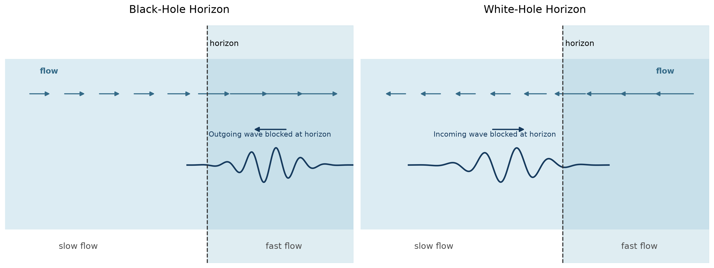
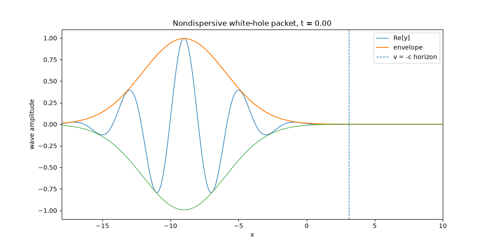
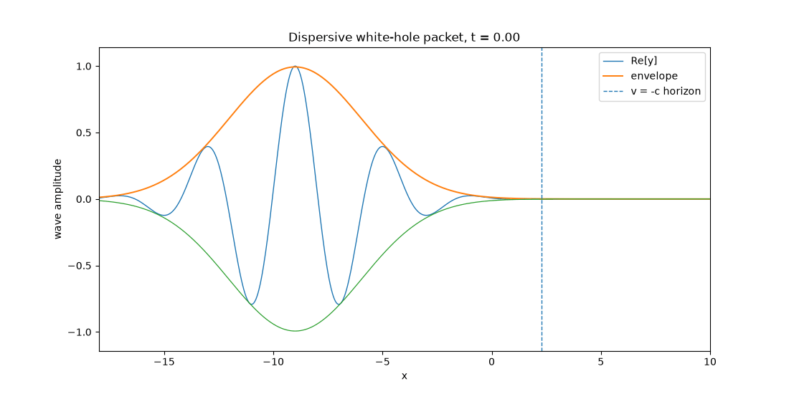
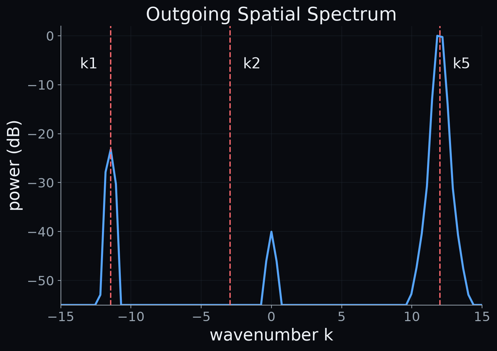

# [Working Title]

### *[Working Subtitle]*

<!--
Purpose:
- Open with the familiar intuition of a black-hole horizon.
- Turn this immediately into a wave question rather than starting with Hawking radiation.
- Set up the central experiment of the post: what happens when a wave approaches such a boundary?
- Keep the Hawking connection hidden for now.
-->

[Opening paragraphs]

We normally think of a black-hole horizon as a point of no return. Once light crosses it, even travelling at the speed of light is no longer enough to escape.

But horizons are not unique to gravity. Waves travelling through a flowing medium can encounter the same basic problem: the medium itself can move faster than the wave can propagate against it.

So, what happens if we actually send a wave toward such a horizon?

---

## Black Holes, White Holes, And A Wave That Cannot Pass

<!--
Purpose:
- Explain black-hole versus white-hole horizons with the minimum physics needed.
- Introduce time reversal as the intuitive connection between them.
- Explain why we use the white-hole version: we can launch a wave from the accessible side and watch what happens.
- Do not introduce Hawking radiation, positive/negative frequency, or quantum mechanics yet.
-->

- Waves propagate relative to a medium while the medium itself can also move.
- If the flow becomes sufficiently fast, a wave can no longer travel against it.
- In the black-hole version:
  - a wave inside the fast-flow region cannot escape.
- Reverse the process:
  - an incoming wave can no longer enter the fast-flow region.
  - this is the white-hole version.
- The white-hole geometry is convenient because we can launch a wave toward the horizon and watch the process unfold.

**Figure 1 — Black-hole and white-hole horizons.** In a black-hole analogue, a wave in the fast-flow region cannot escape against the current. Reverse the process and we obtain a white-hole horizon: an incoming wave encounters a region it cannot enter. The white-hole version allows us to launch a wave toward the horizon and watch what happens. Image by author.

*Alt text: Side-by-side schematic of black-hole and white-hole analogue horizons. In the black-hole panel, the background flow points toward a fast-flow region and a wave trying to escape is blocked at the horizon. In the white-hole panel, the flow direction is reversed and an incoming wave approaching from the slow-flow side is blocked from entering the fast-flow region.*

---

## Let Us Send In A Wave

<!--
Purpose:
- Move quickly from the static horizon picture to the first simulation.
- Start with the simplest nondispersive model.
- Let the reader see the slowing and compression before explaining what goes wrong.
- Combine the visual result and the numerical/trans-Planckian issue into one continuous section rather than creating several separate conceptual stops.
-->

- Use the simplest possible model:
  - one wave speed relative to the medium;
  - no dispersion;
  - smooth transition from slow to fast flow.
- Launch a wave packet from the slow-flow side toward the white-hole horizon.
- The packet travels against the current.
- As the counter-current becomes stronger:
  - its lab-frame group velocity decreases;
  - the packet slows;
  - its wavelength becomes shorter and shorter.

**Figure 2 — A wave approaching a smooth white-hole horizon without dispersion.** The wave travels against an increasingly strong current. Its progress slows while its wavelength becomes shorter and shorter. In the simulation the wave eventually appears to disappear close to the horizon. Image by author.

*Alt text: Animation of a localized wave packet travelling toward a white-hole horizon through an increasingly strong opposing flow. The packet slows down and its oscillations become progressively shorter in wavelength near the horizon.*

- The wave has not really been absorbed.
- Our numerical grid simply has a smallest wavelength it can represent.
- In the ideal nondispersive continuum model there is no such cutoff.
- As the horizon is approached:
  - group velocity tends to zero;
  - wavenumber tends toward infinity;
  - wavelength tends toward zero.
- Eventually the simulation can no longer resolve it.

This gives us an unexpectedly useful analogy.

Hawking's calculation has no numerical grid, but standard relativistic field theory also contains no short-wavelength cutoff. Trace a late outgoing mode backwards toward the horizon and its wavelength becomes exponentially shorter, eventually reaching scales far beyond those where we know ordinary quantum field theory can be trusted.

This is the famous 'trans-Planckian problem'.

Possible pull quote:

> **Our computer runs out of resolution because the wavelength keeps shrinking. Hawking's calculation runs into unknown physics for essentially the same reason.**

---

## What If We Make The Horizon Sharp?

<!--
Purpose:
- Perform one more controlled numerical experiment before adding physical dispersion.
- Show that an abrupt background can itself cause reflection.
- Make clear that this is ordinary scattering within the nondispersive mode structure, not Hawking-like positive/negative-frequency conversion.
- Set up a contrast that will be explicitly recalled when dispersion is added.
-->

- Replace the smooth transition by a much sharper one.
- Launch the same kind of nondispersive packet.
- Now part of the wave reflects from the abrupt change before the numerical blueshift runs away.
- Its propagation direction reverses.

**Figure 3 — Reflection from a sharp nondispersive horizon.** When the change in flow becomes sufficiently abrupt, part of the incoming wave reflects before the numerical blueshift becomes arbitrarily large. This is ordinary scattering from a sharp background change within the same nondispersive mode structure; no additional dispersive modes have yet appeared. Image by author.

*Alt text: Animation of a wave packet travelling toward a sharp white-hole transition. Part of the packet reflects back toward the slow-flow region while the background remains nondispersive.*

- Important distinction:
  - reflection does not by itself imply a new mode branch;
  - we still have the same nondispersive wave physics.
- This will matter once we add dispersion:
  - there, new outgoing components can appear even for a smooth horizon.

---

## But Real Waves Do Not Have One Speed

<!--
Purpose:
- Reconnect to Post 1.
- Explain why the nondispersive model must eventually fail for real surface waves.
- Use this to motivate the dispersive simulation naturally rather than presenting dispersion as an arbitrary mathematical complication.
- Fold the "what dispersion does empty space have?" discussion into this same section so it remains compact.
-->

- Recall the main lesson from Post 1:
  - real water waves are dispersive;
  - different wavelengths propagate at different phase and group velocities.
- As our packet blueshifts:
  - its wavelength changes;
  - therefore its own propagation speed changes.
- The simple nondispersive prediction cannot continue indefinitely.

At first sight, however, this seems to weaken the analogy with a black hole.

Why should the dispersion relation of water have anything to do with empty space?

The answer is: it probably does not.

In ordinary relativistic quantum field theory, a massless field locally obeys the familiar linear relation between frequency and wavenumber. Hawking's semiclassical calculation effectively follows that theory into the regime of arbitrarily short wavelengths.

But once those wavelengths become smaller than the Planck scale, we do not know whether that description remains valid.

So what dispersion relation should we use instead?

We do not know.

- Water-wave dispersion is not claimed to be the microscopic physics of spacetime.
- Neither is a lattice dispersion.
- Neither is the quartic dispersion used in our numerical model.
- The interesting question is different:
  - if we change the unknown high-frequency physics, which features of the horizon process survive?

Possible pull quote:

> **The point is not that water has the right microscopic physics. The point is that we do not know the right microscopic physics — so we can ask what survives when we change it.**

- Modified-dispersion studies find Hawking-like behaviour under a broad range of conditions. As Barceló, Liberati and Visser lay out in their analogue-gravity review, this robustness is not unconditional: it depends on assumptions about the short-wavelength state and how it evolves, and whether real black-hole physics satisfies all of those conditions remains an open question.
- This is precisely one reason analogue systems are interesting: unlike an astrophysical black hole, their microscopic physics is known and can sometimes be varied deliberately — the same review develops this point at length.

---

## Turn On Dispersion

<!--
Purpose:
- Deliver the main visual reveal.
- Repeat essentially the same smooth-horizon experiment, now with dispersive wave physics.
- Let the reader see the extra components first and explain their origin afterwards.
- Explicitly contrast this with the sharp-boundary reflection from the previous section.
-->

- Return to the smooth horizon.
- Keep the incoming packet and overall geometry similar.
- Now use a subluminal dispersion relation.
- As the wave approaches the blocking region:
  - it blueshifts;
  - the shortening wavelength changes its group velocity;
  - dispersion becomes important;
  - new components appear.

Unlike the reflection from our sharp nondispersive boundary, this does not require an abrupt transition. The new behaviour comes from the additional wave solutions created by dispersion itself.

**Figure 4 — The same smooth horizon with dispersion.** Once wave speed depends on wavelength, the blueshift changes the propagation itself. Near the blocking region the incoming packet converts into additional wave components. One returns toward the slow-flow region, while another mode can continue into the fast-flow side of the white-hole horizon. Image by author.

*Alt text: Animation of a dispersive wave packet approaching a smooth white-hole horizon. As the incoming packet reaches the blocking region, shorter-wavelength components appear. One propagates back toward the slow-flow region while another component continues through the horizon into the fast-flow region.*

This is the first point where the behaviour is qualitatively different from our nondispersive model.

The horizon has not simply stopped the wave.

It has changed it into other waves.

---

## One Frequency, Several Waves

<!--
Purpose:
- Explain the mechanism only after the reader has seen it.
- Use the dispersion diagram from Post 1 to show why extra wave components are possible.
- Establish conservation of laboratory frequency in a stationary background.
- Introduce positive and negative comoving frequency, but postpone the quantum interpretation until later.
-->

- The background is stationary, so laboratory-frame frequency ω remains fixed.
- With a straight nondispersive relation, that gives only the familiar branches.
- With a curved dispersion relation:
  - one value of ω can correspond to several allowed values of k.
- Graphically:
  - draw the dispersion curve in the comoving frame;
  - draw the Doppler-shifted line ω − uk;
  - each intersection corresponds to an allowed mode.
- As the flow changes:
  - intersections move;
  - roots can merge;
  - different outgoing solutions become available.

**Figure 5 — One laboratory frequency, several possible wave modes.** The curved line shows the dispersion relation in the frame moving with the medium; the straight line represents the Doppler-shifted laboratory frequency. Their intersections give the allowed wavenumbers. As the flow changes, the number and character of the possible modes change, allowing an incoming wave to scatter into several distinct components. Image by author.

*Alt text: Dispersion diagram showing a curved frequency-versus-wavenumber relation intersected by a sloping Doppler line at several points. The intersections identify multiple wavenumbers that share the same laboratory-frame frequency.*

- One of the solutions has negative comoving frequency:
  - ω′ = ω − uk < 0.
- This is not simply a wave travelling in the opposite direction.
- Its sign refers to the frequency measured relative to the moving medium.
- In the corresponding conserved inner product, this mode has negative norm.

Important caveat:

- The exact four-root structure in our simulation belongs to our chosen toy dispersion.
- It is not universal.
- Water-wave experiments commonly discuss three relevant counter-propagating roots.

---

## This Is Not Just A Simulation

<!--
Purpose:
- Ground the numerical result in real experimental work before introducing Hawking.
- Show that blocking and conversion into positive- and negative-norm modes have actually been observed in flowing water.
- Keep the interpretation classical at this stage.
-->

- Schützhold and Unruh proposed shallow-water surface waves as a controllable analogue system.
- Rousseaux and colleagues observed the conversion of an incident positive-frequency wave into a negative-frequency component in moving water, and describe this positive/negative-frequency mixing as the classical mechanism associated with the Hawking process.
- Weinfurtner and colleagues later launched long surface waves toward a white-hole blocking region and measured the resulting converted waves, explicitly describing their experiment as stimulated Hawking emission at a white-hole horizon.
- The incoming wave was converted into shorter-wavelength components with positive and negative norm.
- These experiments are stimulated:
  - an incoming classical wave is deliberately supplied;
  - the horizon scatters it into other modes.

[Optional experimental image or apparatus schematic]

**Figure 6 — Stimulated horizon scattering in flowing water.** In laboratory white-hole analogues, an imposed long surface wave propagates against the current until it reaches a blocking region. The incoming wave can then convert into shorter-wavelength positive- and negative-norm components, providing an experimental realization of the classical mode conversion associated with the Hawking process. [Source or adaptation credit as appropriate.]

*Alt text: Schematic or experimental view of a flowing-water horizon experiment. A long incoming surface wave travels against the current toward a blocking region and is converted into shorter-wavelength outgoing components.*

---

## Nice — But What Does This Have To Do With A Black Hole?

<!--
Purpose:
- Make the main narrative pivot only after the water-wave physics has been established.
- Ask the skeptical question explicitly.
- Reveal the connection to Hawking through backwards propagation and time reversal.
- Close the loop back to Figure 1.
-->

So far we have learned something rather interesting about waves in flowing water.

But a black hole in deep space contains neither water nor a wave generator.

**What does any of this have to do with Hawking radiation?**

- Start with a wave packet observed far from a black hole.
- Hawking's reasoning can be understood by tracing such an outgoing mode backwards toward the horizon.
- Close to the horizon:
  - the backwards-traced packet becomes enormously blueshifted;
  - when expressed relative to a freely falling observer, it contains both positive- and negative-frequency components.
- Jacobson's treatment of quantum fields in curved spacetime emphasizes this distinction between frequency measured at infinity and frequency measured by a freely falling observer.
- Now reverse the movie.
- A black-hole process traced backwards becomes a white-hole scattering process traced forwards.
- That is essentially the geometry we have just simulated and the water-wave experiments realize.

[Insert Hawking backwards-tracing / spacetime diagram]

**Figure 7 — Hawking's argument viewed backwards in time.** An outgoing wave packet detected far from a black hole can be traced backwards toward the horizon. Relative to a freely falling observer, its near-horizon precursor contains both positive- and negative-frequency components. Reversing the movie turns this into the white-hole scattering process explored in analogue experiments. Image by author / adapted as appropriate.

*Alt text: Space-time diagram of an outgoing wave packet near a black-hole horizon. When traced backwards in time, the packet approaches the horizon and separates into positive- and negative-frequency precursor components. Reversing the direction of time gives the corresponding white-hole scattering picture.*

---

## From Negative Frequency To Particle Creation

<!--
Purpose:
- Explain the quantum step as compactly as possible.
- Connect the classical positive/negative-frequency mixing to creation and annihilation operators.
- Immediately use this to distinguish spontaneous Hawking radiation from our stimulated classical experiment.
- Avoid turning this into a standalone quantum-field-theory tutorial.
-->

Classically, positive- and negative-frequency components are simply parts of the wave field.

The interpretation changes when the field is quantized.

- Positive-frequency modes are associated with annihilation operators.
- Negative-frequency modes are associated with creation operators.
- A transformation that mixes positive and negative frequencies therefore mixes annihilation and creation operators.
- In quantum field theory, this means that the definition of 'no particles' before and after the process is different.
- Particle creation becomes possible.

Possible pull quote:

> **Classically we see mode conversion. Quantize the same field, and positive/negative-frequency mixing becomes particle creation.**

### Did We Just Make Hawking Radiation?

No.

- Our simulation begins with an incoming classical wave.
- The water experiments deliberately inject a wave.
- The horizon then scatters that excitation.
- This is stimulated mode conversion.
- Hawking radiation from a black hole is spontaneous:
  - no incoming classical wave is needed;
  - the quantum state itself supplies the fluctuations.

But stimulated and spontaneous processes are governed by the same underlying mode mixing.

That is why measuring the classical conversion is interesting.

We are not creating an evaporating black hole in a water tank.

We are probing one of the mechanisms that makes Hawking radiation possible.

---

## How Close Can A Water Basin Get?

<!--
Purpose:
- End with the scope and limitation of the analogy.
- Emphasize what was genuinely demonstrated without implying that water reproduces full gravity.
- Return to the unknown short-distance physics and the practical difficulty of observing astrophysical Hawking radiation.
- Finish with an open question.
-->

- A water tank is not a black hole.
- Its background flow does not obey Einstein's equations.
- Surface waves are not photons.
- Our numerical model is more abstract still:
  - its dispersion relation is deliberately simplified;
  - its purpose is to expose blocking and mode conversion.

What analogue systems can reproduce includes:

- horizon kinematics;
- the runaway blueshift of the nondispersive approximation;
- the effect of modified high-frequency dispersion;
- positive/negative-frequency mode conversion;
- stimulated horizon scattering.

What they do not automatically reproduce includes:

- the dynamics of spacetime governed by Einstein's equations;
- the complete quantum state around an astrophysical black hole;
- spontaneous quantum Hawking emission.

The important point is perhaps not that our analogue has the 'right' short-distance physics.

We do not know what the right short-distance physics of spacetime is.

Instead, analogue systems let us alter that physics deliberately and see what survives. Under a broad range of conditions studied so far, Hawking-like mode conversion does survive — although whether real black holes satisfy all the assumptions required for that robustness remains an open question, as Barceló, Liberati and Visser discuss in their review of the field.

Direct Hawking radiation from ordinary astrophysical black holes is also extraordinarily difficult to observe: for stellar-mass black holes the expected Hawking temperature is far below the surrounding cosmic microwave background.

So analogue experiments may be among the closest experimental routes we currently have to the physics underlying Hawking's prediction.

**How much of Hawking radiation belongs specifically to gravity — and how much belongs to horizons themselves?**

---

## References

<!--
Purpose:
- Keep the reference list focused on papers actually used in the narrative.
- Prefer original sources for the key conceptual steps.
- Distinguish clearly between the original Hawking result, analogue proposals, stimulated experiments, and modified-dispersion studies.
-->

Core references:

1. S. W. Hawking — original black-hole radiation paper.
2. W. G. Unruh (1981) — acoustic black-hole analogy.
3. R. Schützhold & W. G. Unruh (2002) — gravity-wave / water-wave analogue.
4. G. Rousseaux et al. (2008) — observation of negative-frequency waves in water.
5. S. Weinfurtner et al. (2010 / 2013) — stimulated Hawking emission in surface waves.
6. U. Leonhardt & S. Robertson (2012) — Hawking radiation in dispersive media.
7. C. Barceló, S. Liberati & M. Visser — analogue-gravity review and UV robustness.
8. T. Jacobson — quantum fields in curved spacetime, Hawking effect, and the trans-Planckian question.

<!--
Specific sourcing cautions:

- Do not imply that Hawking proposed a particular Planck-scale dispersion relation.
- Standard semiclassical Hawking theory uses ordinary local relativistic quantum field theory.
- The actual microscopic high-frequency behaviour of spacetime is unknown.
- Modified-dispersion models often recover Hawking-like behaviour under suitable assumptions; do not claim complete independence from UV physics.
- The exact four-root structure belongs to our toy model.
- Water-wave experiments generally discuss three relevant counter-propagating roots.
- Distinguish negative comoving frequency from merely negative k or leftward propagation.
- Distinguish classical stimulated mode conversion from spontaneous quantum Hawking radiation.
-->