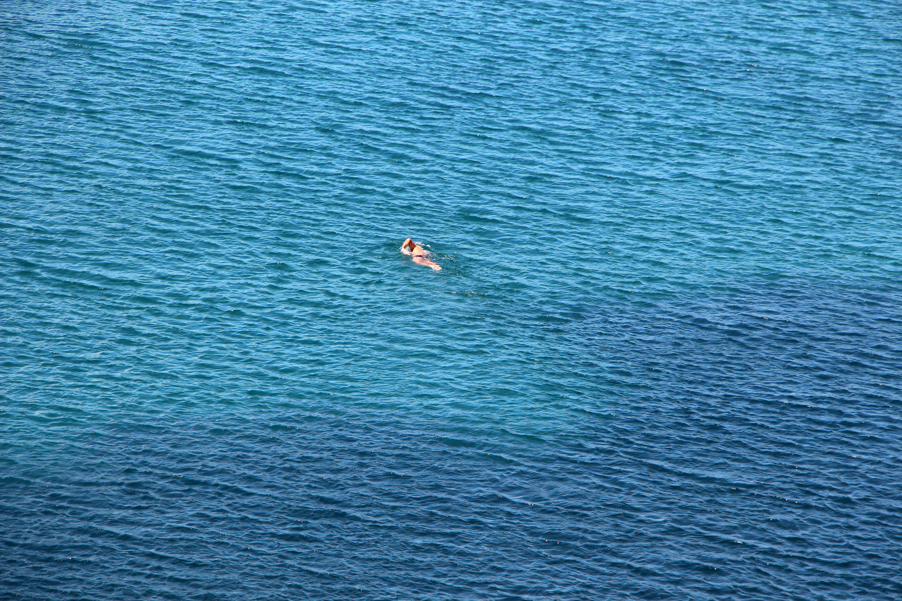
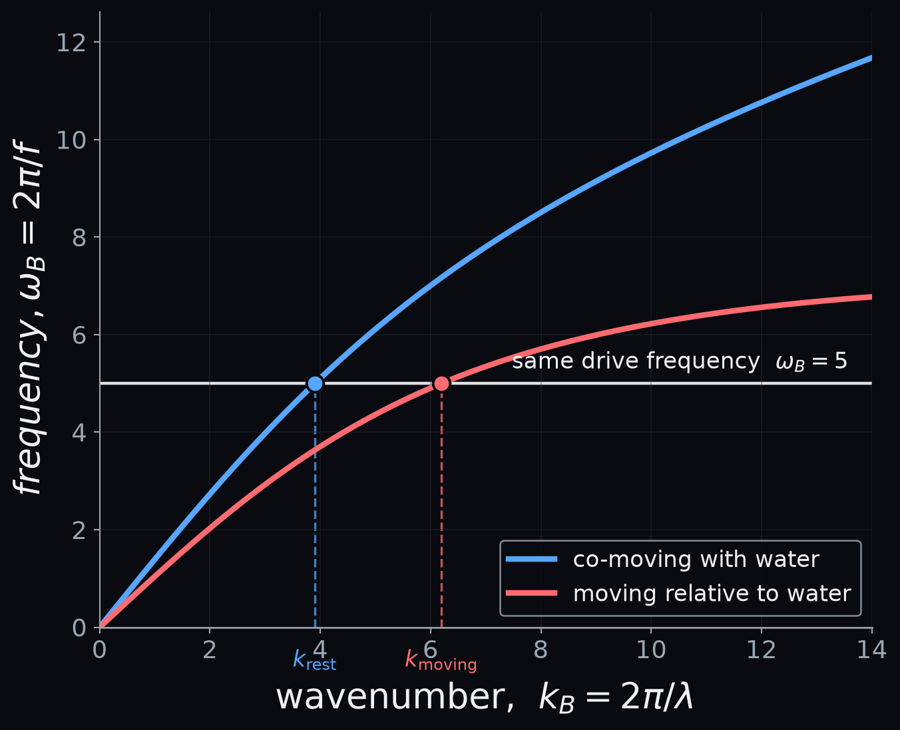
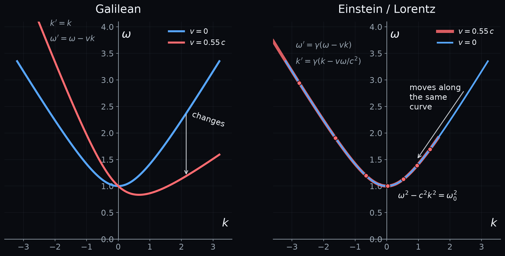
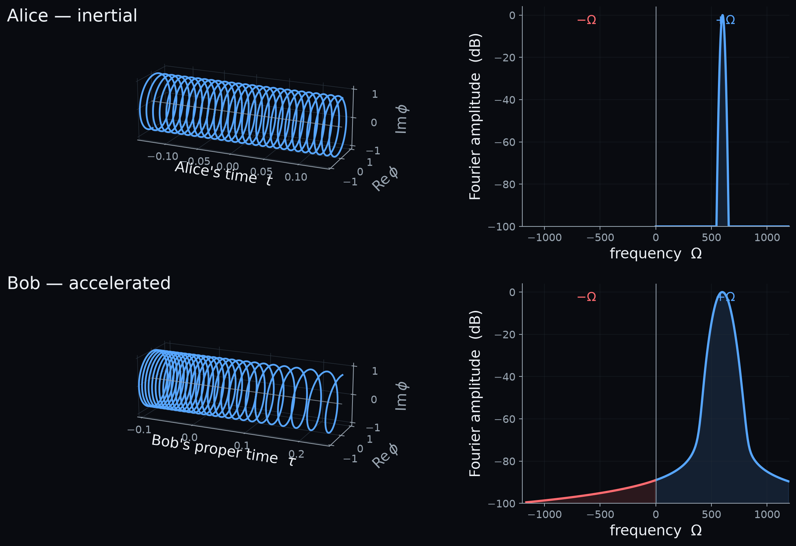
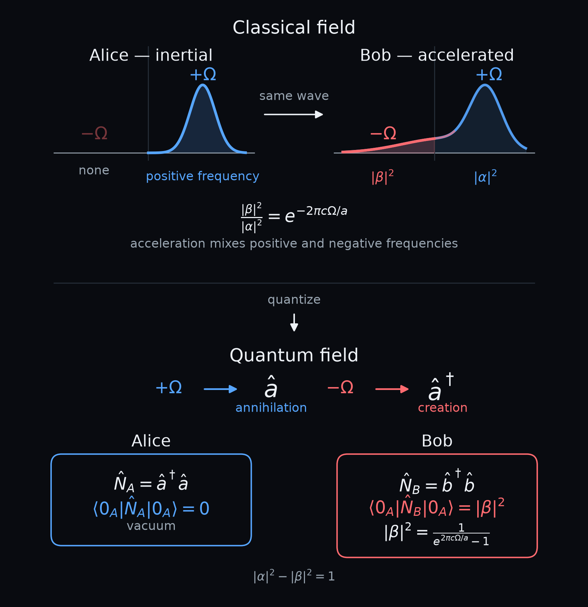
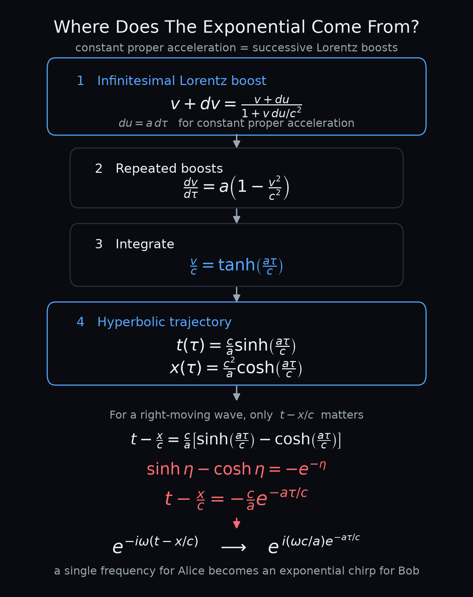

# Relativity Of Nothingness

## How one observer sees vacuum where another sees a hot bath

> **Feature image — How fast am I going?** Bob is swimming in an apparently endless ocean, with no shore, boat, or landmark in sight. The question looks simple, and the water itself turns out to provide the answer. Photo: Peter Berglund/iStock.

> *Alt text: A lone swimmer in a featureless ocean stretching to the horizon, with no land or other visible reference point. The scene poses the question of whether the observer can determine his own motion.*

A person (let's call him Bob) is swimming in a seemingly endless ocean, asking: how fast am I moving through the water? From experience we know that this question can be answered by observing the waves on the water surface.

Now consider Einstein's relativity, where we learn that absolute speed does not exist, and all observers moving at constant speed should have the same experience. What would a hypothetical medium look like, where Bob could not determine his speed at all, and where his friend Alice, moving at a different speed, would have exactly the same experience? How would it be different from ordinary water? It turns out that the answer to this question prescribes a specific kind of medium, with a well-defined dispersion relation.

Then let Bob fire his engines: he starts accelerating. Acceleration breaks the symmetry, and Bob certainly feels that he accelerates while his friend Alice remains at rest. If they both look at the same wave, what is a constant frequency for Alice turns into a chirped frequency for Bob. So, where Alice hears a single tone, Bob hears a spectrum.

Now apply quantum physics. In quantum field theory, positive-frequency modes are paired with annihilation operators, while negative-frequency modes are paired with creation operators. As we will see, this means that what looks like empty vacuum to Alice can appear to Bob as a space populated with thermal particles.

> **How can two observers disagree about whether space is empty?**

## The Ocean Gives The Game Away

So how, exactly, does Bob use the water to answer his question? He can move the water surface at a fixed frequency, and measure the wavelength that comes out. In the frame where the water is at rest, surface waves obey their own intrinsic dispersion relation:

$$
\Omega^2 = gk\tanh(kh)
$$

This relation ties frequency *Ω* and wavenumber *k* together in one specific way, and only in one specific frame. If Bob is moving relative to the water, the frequency he measures is Doppler-shifted:

$$
\omega_B = \Omega(k) - vk
$$

So, the same drive frequency no longer corresponds to the same wavelength. At rest relative to the water, his fixed frequency picks out one wavenumber. Moving relative to it, that same frequency picks out a different one. Measure the wavelength, and Bob has measured his own speed; not some absolute speed, but his speed relative to the water.

That last qualification matters more than it might look. Bob has not learned whether "the water is moving." He has only learned how fast he is moving with respect to it. What Bob has found is a physically preferred frame: the one frame in which the medium is at rest, and its own dispersion relation takes the simple form above.

**Figure 1 — Bob's local wave experiment.** Bob drives surface waves at the same frequency according to his own clock and measures their wavelength. When he is at rest relative to the water, the drive frequency intersects the intrinsic water-wave dispersion relation at one wavenumber. Moving relative to the water Doppler-shifts the relation and the same measured frequency corresponds to a different wavenumber — and therefore a different wavelength. Image by author.

*Alt text: Dark-background dispersion plot of frequency versus wavenumber. A blue curve shows the surface-wave dispersion measured when Bob is at rest relative to the water, and a red shifted curve shows the relation when he moves relative to it. A horizontal line at one fixed measured frequency intersects the curves at two different wavenumbers, labelled k_rest and k_moving.*

## What If There Is No Water?

For a long time, physicists suspected light might work the same way. If light were just another wave travelling through some material-like medium, call it the ether, then in principle its dispersion relation should reveal that medium's rest frame too, exactly the way Bob's water waves revealed his.

Nobody was ever able to measure this ether. So, let us turn the question around entirely. Suppose no local experiment — none, ever — can reveal a preferred frame at all. What kind of dispersion relation should the medium have to survive that requirement?

Note that "no preferred frame" on its own does not single out relativity. Ordinary Galilean physics also has no preferred inertial frame — a ball thrown on a moving train looks just as ordinary to a passenger as to someone standing on the platform. So the requirement alone is not enough; what matters is how frequency and wavenumber are allowed to transform when we change observers. That is where Galilean and Lorentzian physics part ways, and it is worth looking at side by side.

## The Same Curve For Everyone

Let's start with a hyperbolic dispersion relation and ask what kind of 'ether' it would describe:

$$
\omega(k) = \sqrt{\omega_0^2 + c^2k^2}
$$

Under a Galilean change of observer, wavenumber stays fixed while frequency shifts by the relative velocity (the Doppler shift):

$$
k' = k, \qquad \omega' = \omega - vk
$$

Plug that in, and the relation changes shape entirely — a new observer moving at speed *v* no longer sees a wave obeying the same curve. The dispersion relation itself is observer-dependent, which is just another way of saying that a Galilean observer could, in principle, use it to find their own speed, the same way Bob used the water.

Now do the same thing with a Lorentz transformation instead (γ is the familiar Lorentz factor):

$$
\omega' = \gamma(\omega-vk) \\[0.5cm]
k' = \gamma\left(k-\frac{v\omega}{c^2}\right)
\\[0.5cm]
\gamma = \frac{1}{\sqrt{1-v^2/c^2}}
$$

Here something different happens. Individual points — a given *ω* and *k* — do change coordinates; a wave that looked like frequency *ω* to one observer really does look like a different frequency *ω′* to another. But plug the transformed *ω′* and *k′* back into the original relation, and they still satisfy it. The point has moved, but it has moved along the same hyperbola.

> **The dispersion relation itself, the shape of the curve, not the coordinates of any one point on it, stays exactly the same for every inertial observer.**

That is the property we were looking for. A wave obeying this dispersion relation gives no inertial observer a way to find a preferred frame, because there simply isn't one to find — every inertial observer describes the same physics with the same equation, just different coordinates on it. In the massless limit, ω₀ → 0, this reduces to the familiar ω = ±ck: light, unable to pick out a rest frame because there is nothing left in the equation for a frame to attach to.

So, just taking the hyperbola

$$
\omega^2-c^2k^2=\omega_0^2
$$

as a dispersion curve does not, on its own, give us an undetectable 'ether'. We need to add the mixing of space and time components that follow from a Lorentz transformation. The medium that does the trick is, ultimately, space-time itself.

**Figure 2 — What must an undetectable 'ether' look like?** Both panels start with the same dispersion relation. A Galilean change of observer changes the curve itself. Under a Lorentz transformation, individual frequency and wavenumber coordinates change, but the transformed points remain on the same hyperbola. The dispersion relation therefore has the same form for every inertial observer. Image by author.

*Alt text: Two dark-background dispersion diagrams labelled Galilean and Lorentz. In the Galilean panel a red transformed dispersion curve departs visibly from the original blue hyperbola. In the Lorentz panel red transformed points lie along the same blue hyperbola, illustrating that the individual coordinates change while the dispersion relation remains invariant.*

## So Far, Alice And Bob Still Agree

Now consider Alice. Alice and Bob can move at different constant velocities through space-time and still agree completely about waves. Not on the numbers: Alice and Bob will measure different frequencies and different wavelengths for the very same wave. But the relation between their personal frequency and wavelength is the same for both: they see the same dispersion relation.

There is something else they agree about. If a wave has a 'positive frequency' for Alice, then it also has positive frequency for Bob. Lorentz transformations can Doppler-shift the frequency, sometimes enormously, but two inertial observers cannot transform a positive-frequency mode into a negative-frequency one. In other words, they may disagree about the frequency of a wave, but they agree about which way its phase evolves in time.

Now change one thing. Instead of coasting at a constant velocity, Bob fires his engine and accelerates.

That single change turns out to matter enormously. An observer moving at constant velocity has one inertial frame, for all time. An accelerating observer does not — Bob's instantaneous rest frame is a different inertial frame at every instant along his path, continuously boosting relative to the last.

This is where the story turns.

## Now Let Bob Accelerate

Bob turns on his engine at such power that he feels a constant proper acceleration *a*. This is not a constant acceleration as seen from Alice's frame, but constant acceleration as Bob experiences it.

We won't work through the full derivation, but we did put it in the appendix for anyone who wants to see it step by step. The result is a trajectory that traces out a hyperbola in Alice's coordinates:

$$
t(\tau) = \frac{c}{a}\sinh\!\left(\frac{a\tau}{c}\right), \qquad x(\tau) = \frac{c^2}{a}\cosh\!\left(\frac{a\tau}{c}\right)
$$

Here *τ* is Bob's own proper time, the time on his own wristwatch. Bob's velocity, as seen by Alice, v/c = tanh(aτ/c), approaches the speed of light as *τ* grows, but never reaches it. He is forever accelerating, forever getting closer to c.

Now imagine a single, perfectly ordinary wave — a pure tone, one fixed frequency *ω*, of the kind Alice could send to any observer without a second thought. In Alice's coordinates, its phase depends only on t − x/c, the usual combination for a wave moving to the right. Substitute in Bob's hyperbolic trajectory, and t − x/c collapses into a single exponential in Bob's proper time,

$$
t - \frac{x}{c} = -\frac{c}{a}\, e^{-a\tau/c}
$$

So for Bob, in his own time, the wave is not a pure tone at all. The phase is an oscillation whose instantaneous frequency changes exponentially with Bob's proper time.

$$\phi(\tau) = \exp\!\left[i\,\frac{\omega c}{a}\, e^{-a\tau/c}\right]$$

> **Alice sent one frequency. Bob receives a chirp.**

To see what that chirp actually contains, Fourier-transform it with respect to Bob's own proper time. This produces a new spectral variable — call it *Ω*, to keep it distinct from Alice's original carrier frequency *ω* — which is the natural frequency label for Bob's own decomposition of the field.

**Figure 3 — One frequency becomes a chirp.** Left: the same wave, plotted as a helix against Alice's time (top) and Bob's proper time (bottom). For Alice the turns are evenly spaced — a single frequency. For Bob the turns compress at early times and stretch apart later, the signature of a continuously changing instantaneous frequency. Right: Fourier spectra of representative finite wave packets, plotted against Fourier frequency *Ω*; the acceleration used here differs from the helix panels, chosen purely for visual clarity. Alice's spectrum is a single sharp peak at +*Ω*. Bob's spreads into a broad peak and develops a faint tail reaching into negative *Ω* — the first hint that Bob's own decomposition into positive and negative frequency will not agree with Alice's. Image by author.

*Alt text: Two pairs of plots. Top left, a 3D helix of constant pitch labelled Alice's time, representing a single-frequency wave. Bottom left, a helix labelled Bob's proper time, with turns compressed near one end and stretched apart near the other, showing a chirping frequency. Top right, a Fourier amplitude spectrum for Alice with a single sharp peak at positive frequency *Ω* and no content at negative *Ω*. Bottom right, a Fourier amplitude spectrum for Bob with a broadened peak at positive Ω and a small but nonzero tail extending into negative *Ω*.*

It's worth being precise about what that negative-Ω content means. Bob's *instantaneous* frequency, ω(τ) = ω e^{−aτ/c}, is a decaying exponential — it stays strictly positive for every τ; nothing about what Bob experiences moment to moment ever runs the oscillation backwards. The negative-Ω content lives in the *Fourier decomposition* of the entire chirp, taken over all of Bob's proper time. It is a statement about how the complete signal breaks down into stationary building blocks, not about any frequency Bob would actually report at a single instant.

A wave that had a positive frequency for Alice therefore picks up a negative-frequency component in Bob's decomposition. This could never happen for two observers at constant velocity, however different their speeds. Acceleration, it turns out, can make a wave that was purely positive-frequency for Alice contain both positive- and negative-frequency components in Bob's description.

## Bob's Vacuum Isn't Empty

So far we studied the classical, non-quantum view: Alice's pure tone reaches Bob as a chirp, and that chirp gives Bob's spectrum a tail into negative frequency. Quantum mechanics is what gives that tail consequences.

In the quantum theory, the split between positive and negative frequency is not just a labelling convention — it is *the* thing that tells us which operator is which. A positive-frequency mode pairs with an annihilation operator, â; a negative-frequency mode pairs with a creation operator, â†.

We learned earlier that for accelerated Bob, a mode that was purely positive-frequency for Alice becomes a mix of positive and negative frequency in Bob's decomposition. Because his annihilation operator b̂ is built from that mixed decomposition, b̂ is itself a mixture of Alice's â and ↠— weighted by two numbers, the Bogoliubov coefficients *α* and *β*. Their ratio depends on nothing but the ratio of frequency to acceleration:

$$\frac{|\beta|^2}{|\alpha|^2} = e^{-2\pi c \Omega/a}$$

Note what this equation is *not* saying: it is not a statement about Alice's field changing in any way. The field is exactly what it always was. What has changed is what counts as "positive frequency" for Bob — and therefore what Bob's own number operator, N̂_B = b̂†b̂, assigns to Alice's vacuum. Alice's number operator returns exactly zero on her own vacuum, as it must. Bob's does not:

$$\langle 0_A|\hat N_B|0_A\rangle = |\beta|^2$$

That number is a mean occupation, not a click probability: evaluated on the state Alice calls empty, Bob's own number operator gives an expected particle count of |β|². Same state, same field — different answers.

To pin down |β|² itself, we only need one more piece: the normalization that keeps the whole construction consistent, |α|² − |β|² = 1. Combined with the ratio above, it fixes |β|² exactly:

$$|\beta|^2 = \frac{1}{e^{2\pi c \Omega/a} - 1}$$

Readers who know their statistical mechanics will recognize that shape immediately — it is a Bose-Einstein distribution. Not an approximation to one, not something that merely resembles one: for an observer undergoing exactly uniform acceleration forever, this is the exact occupation number of a thermal state, with a temperature set entirely by the acceleration,

$$k_B T_U = \frac{\hbar a}{2\pi c}$$

Alice's vacuum — genuinely empty, by her own reckoning — looks to Bob like a bath of thermal particles, populated according to Planck's own formula, at a temperature fixed by nothing but how hard Bob is accelerating. This is the Unruh effect.

**Figure 4 — From mixed frequencies to a thermal spectrum.** Top: a schematic version of the classical picture from Figure 3 — not the same numerical spectrum, but the same qualitative split — showing Bob's decomposition divided into a positive-frequency part, |α|², and a negative-frequency part, |β|², whose ratio depends only on Ω/a. Bottom: quantizing the field turns positive frequency into an annihilation operator and negative frequency into a creation operator. Alice's vacuum contains no particles by her own count, but Bob's particle-number operator, built from his own mixture of creation and annihilation operators, assigns that same vacuum a nonzero, thermal occupation number. Image by author.

*Alt text: Two-part diagram. Top: two schematic frequency-domain plots (not numerically identical to Figure 3), labelled Alice — inertial and Bob — accelerated, connected by an arrow reading "same wave." Alice's spectrum has only a positive-frequency peak. Bob's spectrum has the same positive-frequency peak, now labelled |α|², plus a smaller negative-frequency component labelled |β|², with the ratio given as an exponential formula. Bottom: a quantization diagram showing positive frequency mapping to an annihilation operator â and negative frequency mapping to a creation operator â†, followed by boxed formulas for Alice's and Bob's number operators, showing that Bob's operator evaluated on Alice's vacuum equals |β|², given by a Bose-Einstein-like expression.*

Alice's own particle-number operator assigns her vacuum exactly zero particles, and nothing about her experience — inertial, unaccelerated — ever suggests otherwise. Bob, doing nothing more exotic than firing an engine, finds that his own particle-number operator assigns that same state a thermal occupation number; an ideal detector undergoing his exact acceleration would show a thermal response. Same field, same state — and yet the two of them fundamentally disagree about how many particles are in the room.

> **Alice calls it vacuum. Bob's particle detector calls it thermal.**

## Real Particles, Or A Question Of Frame?

This phenomenon has a name: the Unruh effect, after William Unruh, who first derived it in 1976 [1], building on closely related, independent work by Fulling (1973) [2] and Davies (1975) [3]. For a comprehensive review of the effect and its many facets, see Crispino, Higuchi & Matsas (2008) [4].

Among physicists, it is not entirely uncontroversial. The standard frequency-mixing and thermal-response calculation — the one worked through in this post — is well established and not itself in dispute. What is more delicate is the interpretation: whether this amounts to Bob being immersed in a literal bath of "real particles," or is better understood as a statement about how a specific detector, moving along a specific trajectory, responds to a field that never changed. Some argue for the latter, more conservative reading — a distinction Sabine Hossenfelder, among others, has pushed in popular discussions, and one examined more technically by Unruh & Wald (1984) [5].

What adds to the controversy is that the effect is fiendishly difficult to measure. At Earth's surface gravity, the Unruh temperature comes out to roughly 4×10⁻²⁰ K — utterly unreachable, nowhere near any noise floor a laboratory could control for. Reaching just 1 K requires an acceleration of about 2.5×10¹⁹ g. Still, some scientists are proposing experiments to get there: Gregori et al. (2024) [6] suggest using ultra-high-intensity lasers to accelerate electrons and an X-ray probe to search for a measurable signature — a serious proposal, and one whose authors are candid that the harder problem is not the acceleration itself but identifying an observable that unambiguously separates Unruh thermality from ordinary radiation.

## What Does It Mean For Space To Be Empty?

We started with Bob swimming in the ocean, asking: how fast am I moving? He could answer because the water itself supplied a frame to measure against. Remove that frame, and the notion of an absolute speed disappears, exactly as relativity demands. Then Bob accelerated. This acceleration changed what Bob and Alice call empty. 

This is not purely theoretical, even if a direct detection remains out of reach. Leonhardt and colleagues demonstrated a classical, stimulated analogue in 2018 [7]: they sampled classical, noisy water waves along trajectories that mimic the Rindler paths of a uniformly accelerated observer, and recovered the same mode-mixing and correlation structure this post has been building toward. It is worth being precise about what that experiment is and isn't — it is a classical analogue, built from water, not a measurement of the quantum Unruh effect itself. Its value is conceptual: it shows that the underlying mathematics of positive/negative-frequency mixing along an accelerated path is not some quirk of quantum field theory, but a property of the kinematics alone. Water, it turns out, was not entirely done with this story.

So, perhaps the strangest part of the Unruh effect is not that acceleration creates something from nothing. It is that quantum field theory forces us to ask what we meant by "nothing" in the first place.

> **We started by asking Bob how fast he was moving. We end with a stranger question: what does it mean for space to be empty?**

## Appendix — Where Does The Exponential Come From?

## References

1. W. G. Unruh, "Notes on Black-Hole Evaporation." *Physical Review D*
   **14**, 870–892 (1976).

2. S. A. Fulling, "Nonuniqueness of Canonical Field Quantization in
   Riemannian Space-Time." *Physical Review D* **7**, 2850–2862 (1973).

3. P. C. W. Davies, "Scalar Production in Schwarzschild and Rindler
   Metrics." *Journal of Physics A: Mathematical and General* **8**,
   609–616 (1975).

4. L. C. B. Crispino, A. Higuchi & G. E. A. Matsas,
   "The Unruh Effect and Its Applications." *Reviews of Modern Physics*
   **80**, 787–838 (2008).

5. W. G. Unruh & R. M. Wald, "What Happens When an Accelerating
   Observer Detects a Rindler Particle." *Physical Review D* **29**,
   1047–1056 (1984).

6. G. Gregori, G. Marocco, S. Sarkar, R. Bingham & C. Wang,
   "Measuring Unruh Radiation from Accelerated Electrons."
   *European Physical Journal C* **84**, 475 (2024).

7. U. Leonhardt, I. Griniasty, S. Wildeman, E. Fort & M. Fink,
   "Classical Analogue of the Unruh Effect." *Physical Review A*
   **97**, 022118 (2018).

